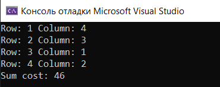

# Hungarian Algorithm O(n^3)(O(n^2m)) Implementation
## Task overview
There are n workers and m jobs. For each worker, it is known how much time he will ask for for completing a particular task. Each worker can take only one task for himself. It is required to distribute tasks among workers so as to minimize total costs.
## Algorithm description
### Imlementation details
- `a[n + 1][m + 1]` the matrix given in the task. Indexes start from 1 for comfort. Thus matrix `a[n + 1][m + 1]` must have fake row and column. In example we use `-1` to fill the fake space.
- `u[n]` and `v[m]` are potential. `u[i] + v[j] <= a[i][j] (i = 1...n, j = 1...m)`
- `p[m]` contains matching column `1...m` to row `1...n`. Has zero value if there is no match. `p[0]` contains the current row number.
- `minv[m]` contains auxiliary mininums to calculate potential for each column `j`.
- `way[m]` contains the information where this minimums can be reached.
- `j0` column that has to be matched with row `i`.
- `i0` the actual row `j0` matched with.
- `j1` minimum column in `i` row.
- `delta` minimum value in column `j1`.
- `used[m]` contains information whether the column `j` was marked in inner loop or not.
- `INF` some value that is always greater than any value in `a[n + 1][m + 1`. In example we use `9999999` value
### Algorithm principle
- Outer loop for each `i` row in `a[n + 1][m + 1]`
- Inner loop for each `j` column in `a[n + 1][m + 1]`
- Mark `j0` as used
- Get `i0` from `p[j0]`
- Loop for every unused column `j` in `a[n + 1][m + 1]`
- Initialize `delta` as `INF`
- Calculate current minimum for this column. `cur = a[i0][j] - u[i0] - v[j]`
- If `cur` lesser than `minv[j]` then `minv[j] = cur` and `way[j] = j0`
- If `minv[j]` lesser than `delta` then `delta = minv[j]` and `j1 = j`
- Loop for every column `j` in `a[n + 1][m + 1]`
- If used, then `u[p[j]] += delta` and `v[j] -= delta`
- Else `minv[j] -= delta`
- Set `j0` equal to `j1`
- Repeat till `p[j0] != 0`
- Loop while `j0 != 0`
- Set `int j1 = way[j0]`, `p[j0] = p[j1]` and  `j0 = j1`
## Example
``````
vector<vector<int>> a{
		{-1, -1, -1, -1, -1},
		{-1, 22, 19, 11, 13},
		{-1, 15, 12, 10, 18},
		{-1, 13, 22, 21, 26},
		{-1, 29, 10, 12, 22} };
``````

